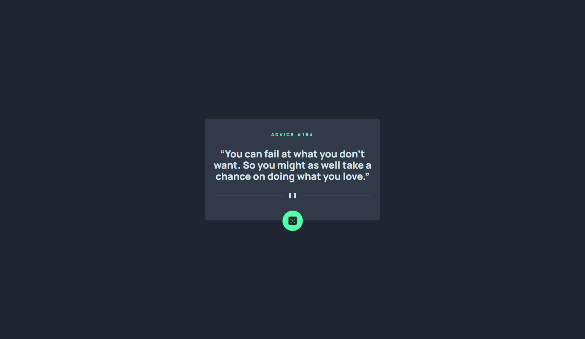

# Frontend Mentor - Advice generator app solution

This is a solution to the [Advice generator app challenge on Frontend Mentor](https://www.frontendmentor.io/challenges/advice-generator-app-QdUG-13db). Frontend Mentor challenges help you improve your coding skills by building realistic projects.

## Table of contents

- [Overview](#overview)
  - [The challenge](#the-challenge)
  - [Screenshot](#screenshot)
  - [Links](#links)
- [My process](#my-process)
  - [Built with](#built-with)
  - [What I learned](#what-i-learned)
  - [Continued development](#continued-development)
- [Author](#author)

## Overview

### The challenge

Users should be able to:

- View the optimal layout for the app depending on their device's screen size
- See hover states for all interactive elements on the page
- Generate a new piece of advice by clicking the dice icon

### Screenshot

### Mobile View

### Desktop View

### Links

- Solution URL: [FrontEnd Mentor](https://www.frontendmentor.io/solutions/advice-generator-app-using-sass-flexbox-and-js-_aJ6ZwZ4al)
- Live Site URL: [Netlify](https://bk-advice-generator.netlify.app/)

## My process

### Built with

- Semantic HTML5 markup
- CSS custom properties
- Sass
- BEM
- Flexbox
- JavaScript
- Advice Slip API
- Async/Await
- Mobile-first workflow

### What I learned

Through this project, I honed my skills in utilizing asynchronous JavaScript and the fetch API to retrieve data from an external source, and dynamically render it on a webpage. I also reinforced my knowledge of writing maintainable and scalable CSS through the use of Sass and BEM methodologies.

### Continued development

To further elevate the functionality and design of this project, I plan to implement a social media sharing feature that allows users to easily share the generated advice. Additionally, I aim to continue to explore advanced design techniques to create a more captivating and immersive user experience.

## Author

- Github - [BK Pecho](https://www.github.com/bkpecho)
- Twitter - [@bkpecho](https://www.twitter.com/bkpecho)
- LinkedIn - [in/bkpecho](https://www.linkedin.com/in/bkpecho/)
- Frontend Mentor - [@bkpecho](https://www.frontendmentor.io/profile/bkpecho)
